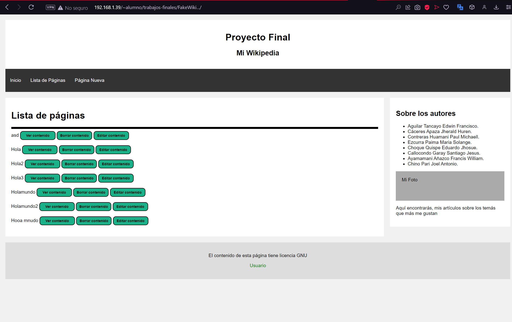

<table>
    <theader>
        <tr>
            <td></td>
            <th>
                UNIVERSIDAD NACIONAL DE SAN AGUSTIN 
                FACULTAD DE INGENIERÍA DE PRODUCCIÓN Y SERVICIOS 
                ESCUELA PROFESIONAL DE INGENIERÍA DE SISTEMAS
            </th>
            <td></td>
        </tr>
    </theader>
    <tbody>
        <tr><td colspan="3">Formato: Guía de Práctica de Laboratorio</td></tr>
        <tr><td>Aprobación:  2022 </td><td>Código: GUIA-PRLD-001</td><td>Página: 1</td></tr>
    </tbody>
</table>

 <h3>INFORME DE LABORATORIO</h3>

<table>
 <theader>
  <tr><th colspan="6" bgcolor="red">INFORMACIÓN BÁSICA</th></tr>
 </theader>
 <tbody>
  <tr><td>ASIGNATUA:</td><td colspan="5">Programacion Web 1 </td></tr>
  <tr><td>TÍTULO DE LA PRACTICA:</td><td colspan="4">Proyecto final <td></tr>
  <tr><td>NÚMERO DE PRÁCTICA:</td><td>Practica de Laboratorio 12</td><td>AÑO LECTIVO:</td><td>2022-B</td><td>NRO. SEMESTRE:</td><td>II</td></tr>
  <tr><td>FECHA DE PRESENTACIÓN:</td><td> 21-Dic-2022</td><td>HORA DE PRESENTACIÓN:</td><td colspan="3">11:30 p.m.</td></tr>

  <tr><td>INTEGRANTES:</td><td colspan="3">Aguilar Tancayo Edwin Francisco.  Cáceres Apaza Jherald Huren. Contreras Huamani Paul Michaell.
    Ezcurra Paima Maria Solange.  Choque Quispe Eduardo Jhosue.   Callocondo Garay Santiago Jesus.   Ayamamani Añazco Francis William.   Chino Pari Joel Antonio. </td><td>NOTA:</td><td>...</td></tr>

  <tr><td>DOCENTE:</td><td colspan="5">Richart Smith Escobedo Quispe - rescobedoq@unsa.edu.pe</td></tr>
 </tbody>
</table>
<table>
 <theader>
  <tr><th>SOLUCIÓN Y RESULTADOS</th></tr>
 </theader>
 <tbody>
  <tr><td><strong>I. Presentacion del Proyecto:</strong> 
  <ul>
    <h1>  FakeWiki  </h1> 
      
Este proyecto es para ayudar en la creacion de paginas de web sin nesesidad de tener conocimiento de HTML, ademas las paginas creadas                      pueden ser modificadas, borradas y se almacenan en una base de datos a la se puede acceder creando un usuario y contraseña. 

          
       <h2> Aqui se muestran los repositorios de avance del proyecto en tres partes </h2>
       <h3> FakeWiki (I entrega) </h3>
       <h4>https://github.com/EdwinAguilarT/FakeWiki..git</h4>
       <h3> FakeWiki (II entrega) </h3>
       <h4>https://github.com/EdwinAguilarT/FakeWiki...git</h4>
       <h3> FakeWiki (III entrega) </h3>
       <h4>https://github.com/EdwinAguilarT/FakeWiki....git</h4>
 </tbody>
</table>

<table>
 <theader>
  <tr><td><strong>REFERENCIAS Y BIBLIOGRAFÍA</strong></td><tr>
 </theader>
 <tbody>
  <tr><td>https://cgi-lib.berkeley.edu/</td></tr>
  <tr><td>https://www.blyx.com/public/docs/expresiones_regulares_perl.html</td></tr>
  <tr><td>http://www.w3big.com/es/perl/perl-regular-expressions.html#gsc.tab=0</td></tr>
 </tbody>
</table>

